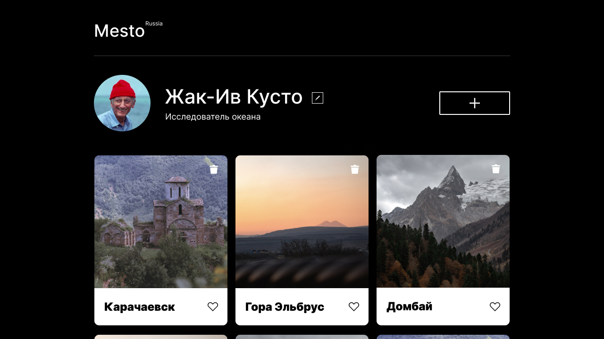

# Сервис [Mesto](https://ivanovanatalya.github.io/mesto)
---
**Проектная работа 12**

Выполнена в рамках обучения на курсе [веб-разработчик Яндекс.Практикум](https://practicum.yandex.ru/web/?utm_source=practicum&utm_medium=email&utm_campaign=sendr-597315).

   

* создан проект на Create React App
* портирована разметка в jsx
* использованы функциональные и классовые компоненты, хуки
* реализована аутентификация пользователяъ

**Figma**
* [Макет в Figma](https://www.figma.com/file/2cn9N9jSkmxD84oJik7xL7/JavaScript.-Sprint-4?node-id=0%3A1)

